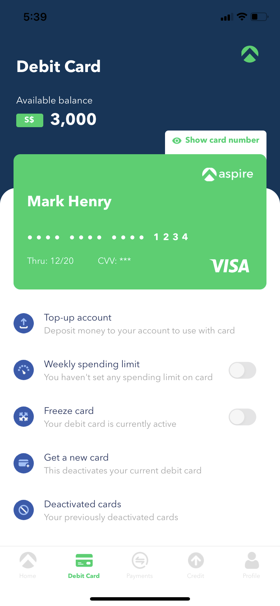
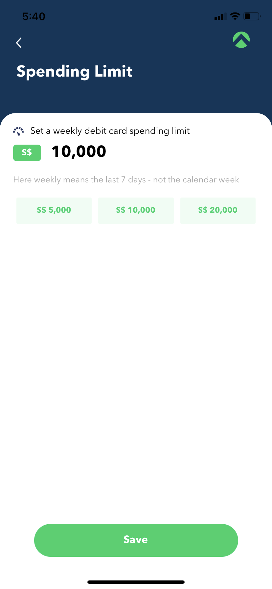
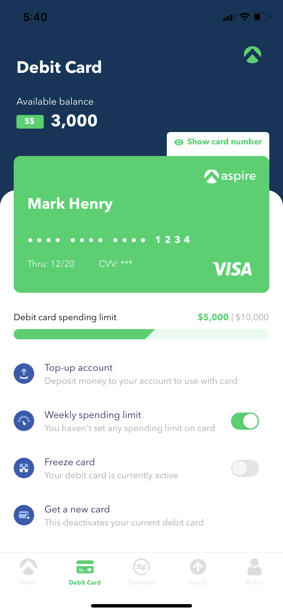

# hut8

Just another react-native app

## Screenshots

</img>
</img>
</img>

## Getting Started

### Android & iOS Environments

1. Follow the [React Native getting started guide here](https://facebook.github.io/react-native/docs/getting-started). Select the **React Native CLI Quickstart** tab, there's no Expo required in this project.

- Install dependencies listed - Node, Watchman, JDK.
- Install React Native CLI globally.

3. Install [Android Studio](https://developer.android.com/studio)

4. Install/update the [latest version of Xcode](https://itunes.apple.com/us/app/xcode/id497799835?mt=12).

5. Install [CocoaPods](https://cocoapods.org) (iOS package management tool):

```
sudo gem install cocoapods
```

### Project Setup

1. Clone this repository

2. CD to the project root, then install package dependencies:

```
npm install
```

3. CD to `[projectroot]/ios` folder and install the project iOS pod dependencies:

```
pod install
```

### Appendix - I

#### List of pending changes/improvements

1. Fetching of member data from API.

2. Persisting weekely spending limit on app close.

3. Matching text fonts more inaccurately.

4. Matching sizing and spacing more inaccurately.

5. Refactoring of common styles.

6. Skeleton loader on Debit Card Tab.

7. App icon and identifier.

8. Splash/Launch screen.

9. Test cases.
